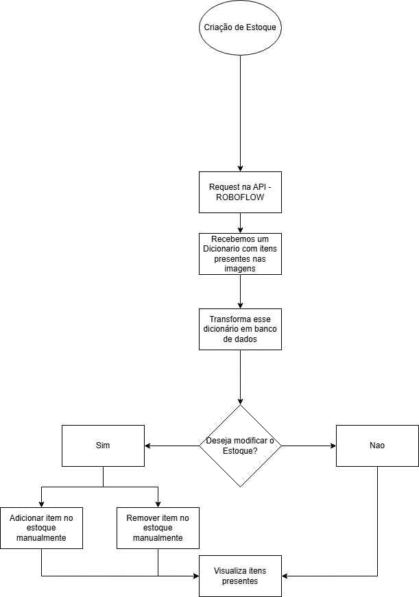

# 📦 Sistema de Estoque com Visão Computacional + Entrada Manual

Este projeto é um sistema simples de gerenciamento de estoque que integra dados preditivos oriundos de visão computacional (via JSON) com funcionalidades manuais para adicionar, atualizar, remover e visualizar itens no terminal.

---

## Integrantes

- Cilas Pinto Macedo - RM560745
- Ian Junji Maluvayshi Matsushita RM560588
- Pedro Arão Baquini - RM559580
- Leandro Kamada Pesce Dimov - RM560381
- Leonardo de Souza Pierangelli - RM560501

---

## 🔍 Funcionalidades

- Leitura de um arquivo `resultado_predicao.json` com as previsões de classes de objetos identificados por um modelo de visão computacional.
- Contabilização automática da quantidade de cada classe detectada.
- Interface em linha de comando para:
  - Adicionar itens manualmente.
  - Atualizar nome ou quantidade de um item.
  - Remover itens.
  - Visualizar o estoque atual em formato tabular.

---

## 🧠 Como funciona

1. **Leitura do JSON**
   - O sistema lê um arquivo chamado `resultado_predicao.json` contendo a chave `"predictions"`, que deve ser uma lista de objetos com a chave `"class"` representando o tipo do item detectado.

2. **Contabilização Automática**
   - Cada ocorrência de uma classe é contabilizada e armazenada em uma estrutura de dicionário.

3. **Manipulação Manual via Terminal**
   - O usuário pode interagir com o sistema por meio de menus e inputs para gerenciar o estoque.

---

## 📁 Exemplo de entrada (`resultado_predicao.json`)
```json
{
  "predictions": [
    {"class": "garrafa"},
    {"class": "garrafa"},
    {"class": "lata"}
  ]
}


